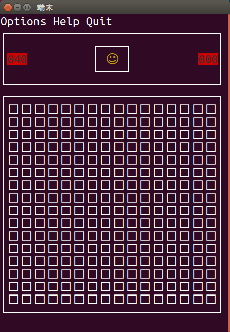

# mineSweeper
---
講義で作成した"マインスイーパー"ゲームです.
端末上で動くTUI(text user interface)ですが，基本操作はクリック，文字に着色もしています．  
ただし，ncursesで実装されているため，linux(Ubuntu)でしか動作しません．  

# Features
端末上で`./mineSweeper.exe`を実行するとゲームが始まる．  

 
# Requirement 
* 仕様言語 C
* 動作OS Ubuntu

# Usage
ゲームの詳細説明は"/仕様書"フォルダにあるためここでは割愛  
 
# Note
 
注意点などがあれば書く  
 
# Author
* 永廣幸太郎  
* 大阪工業大学 情報科学研究科 情報科学専攻   
