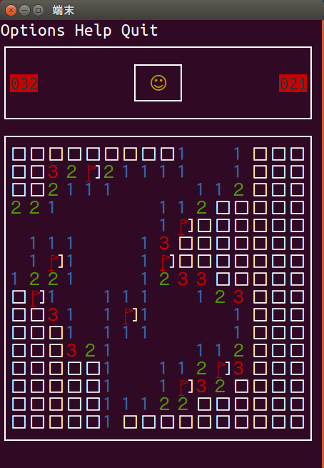
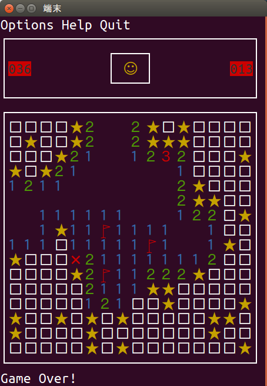
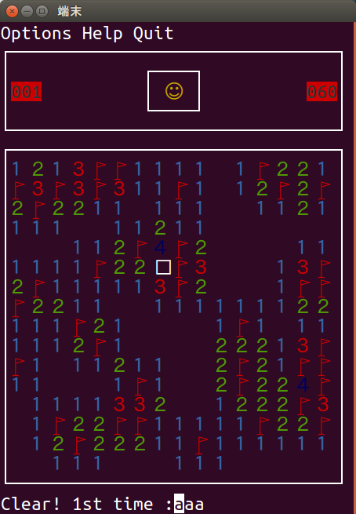
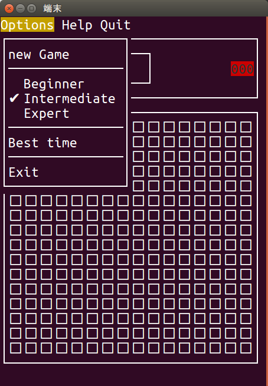
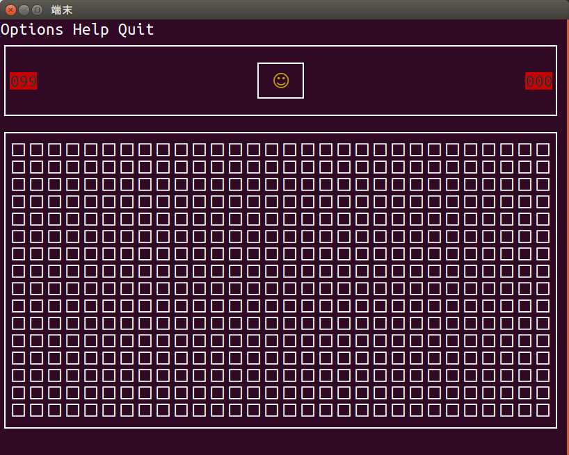

# mineSweeper
講義で作成した"マインスイーパー"ゲームです.
端末上で動くTUI(text user interface)ですが，基本操作はクリック，文字に着色もしています．  
ただし，ncursesで実装されているため，linux(Ubuntu)でしか動作しません．  

# 説明
大学講義での演習課題の一環として作成したゲーム．  
講義ではC言語，Ubuntu環境，端末上で動作することが前提条件となっていた．  
制作は一人かつ外部，内部，テスト仕様書の作成も同時並行であり，課題の制作期間は3ヶ月．  
しかし，はじめに考えていたRPG風ダンジョンゲームの制作が難航したため，変更により実質1ヶ月で完成させている．
仕様書や，構想初期のゲームは両方ともGithubで参照可能である．  
 
# 仕様
* 仕様言語 C
* 動作OS Ubuntu

# 操作
ゲームの操作説明は`/仕様書`フォルダの外部仕様書に詳しいためここでは割愛  
 
# 創意工夫点
過去のWindowsOSに搭載されていたマインスイーパーの完全再現が目標．  
見た目の形状や色はもちろん，端末で動作するTUIでありながらクリック動作やオプションウィンドウの展開を可能としている．  
特にオプションウィンドウの展開には，TUIならではのゲーム画面を崩さず描画する工程に苦労しており，  
フローチャートを書いて描画タイミングを調整することで難を逃れた．  
そのほか時間計測やランキング，難易度変更機能を加え，難易度変更にはマスの大きさに沿って端末のウィンドウサイズを自動変更する機能がある．  
 
# 製作者
* 永廣幸太郎  
* 大阪工業大学 情報科学研究科 情報科学専攻   
